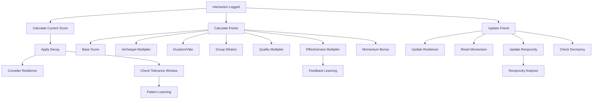

# Weave Key Systems Documentation

This document provides a comprehensive overview of the key systems that power Weave's intelligent relationship tracking. These systems work together to create a mindful, adaptive framework that respects each friendship's unique rhythm while encouraging meaningful connection.

---

## Table of Contents

1. [Weave Score System](#1-weave-score-system)
2. [Adaptive Decay System](#2-adaptive-decay-system)
3. [Archetype Framework](#3-archetype-framework)
4. [Interaction Scoring System](#4-interaction-scoring-system)
5. [Momentum System](#5-momentum-system)
6. [Resilience System](#6-resilience-system)
7. [Quality-Weighted Scoring](#7-quality-weighted-scoring)
8. [Group Dilution & Event Multipliers](#8-group-dilution--event-multipliers)
9. [Pattern Learning System](#9-pattern-learning-system)
10. [Feedback Learning System](#10-feedback-learning-system)
11. [Reciprocity Tracking](#11-reciprocity-tracking)
12. [Dormancy System](#12-dormancy-system)

---

## 1. Weave Score System

**Purpose:** The weave score is the core metric representing relationship health, ranging from 0-100.

### Implementation

**Location:** `src/db/models/Friend.ts:17`

**Key Fields:**
```typescript
@field('weave_score') weaveScore!: number        // 0-100 health score
@date('last_updated') lastUpdated!: Date         // Last score modification
```

### How It Works

- **Range:** 0-100, where higher scores indicate healthier relationships
- **Updated:** Every time an interaction is logged or when decay is calculated
- **Visual Feedback:** Drives card colors, alerts, and UI states throughout the app
- **Cap:** Scores cannot exceed 100 (enforced in `src/lib/weave-engine.ts:319`)

### Score Visualization

- **80-100:** Thriving (bright, positive colors)
- **40-79:** Healthy (neutral tones)
- **25-39:** Drifting (warning colors)
- **0-24:** Critical (alert colors)

---

## 2. Adaptive Decay System

**Purpose:** Scores naturally decay over time to reflect relationship entropy, but the system learns each friendship's natural rhythm.

### Implementation

**Location:** `src/lib/weave-engine.ts:65-90`

**Key Function:** `calculateCurrentScore(friend: FriendModel): number`

### Base Decay Rates (by Dunbar Tier)

**Location:** `src/lib/constants.ts:3-7`

```typescript
TierDecayRates: {
  InnerCircle: 2.5,    // Fastest decay - closest relationships need more attention
  CloseFriends: 1.5,   // Moderate decay
  Community: 0.5,      // Slowest decay - more casual connections
}
```

### Adaptive Decay Logic

The system learns each friend's natural interaction pattern and adjusts decay accordingly:

1. **Within Tolerance Window** (learned pattern):
   - Decay at 50% of base rate: `decayAmount = (days × tierDecayRate × 0.5) / resilience`
   - **Rationale:** If interactions are happening within normal rhythm, minimal penalty

2. **Outside Tolerance Window** (breaking pattern):
   - Base decay for tolerance period + accelerated decay for excess days
   - Accelerated rate: `excessDays × tierDecayRate × 1.5 / resilience`
   - **Rationale:** Relationship health deteriorates faster when natural rhythm is broken

### Tolerance Window

**Location:** `src/lib/pattern-analyzer.ts:161-174`

The tolerance window is dynamically calculated based on:
- **Average interval:** How often you typically interact
- **Consistency score:** How regular your interactions are (0-1)
- **Formula:** `averageInterval × (1.2 + (1 - consistency) × 0.5)`

**Example:**
- Average interval: 14 days, consistency: 0.8 (high)
  - Tolerance: 14 × (1.2 + 0.1) = **18.2 days**
- Average interval: 14 days, consistency: 0.3 (low)
  - Tolerance: 14 × (1.2 + 0.35) = **21.7 days**

### Resilience Modifier

Decay is divided by the friend's resilience value (0.8-1.5):
- **High resilience (1.5):** Score decays 67% slower
- **Base resilience (1.0):** Normal decay
- **Low resilience (0.8):** Score decays 25% faster

---

## 3. Archetype Framework

**Purpose:** Each friend is assigned a tarot archetype that represents their connection style, which modifies how effective different interaction types are.

### The Seven Archetypes

**Location:** `src/lib/constants.ts:304-368`

| Archetype | Icon | Essence | Connection Style |
|-----------|------|---------|------------------|
| **Emperor** | 👑 | Architect of Order | Structure, achievement, planned events |
| **Empress** | 🌹 | Nurturer of Comfort | Warmth, sensory experiences, acts of service |
| **High Priestess** | 🌙 | Keeper of Depth | Deep conversation, intuition, one-on-one |
| **Fool** | 🃏 | Spirit of Play | Spontaneity, novelty, light-hearted fun |
| **Sun** | ☀️ | Bringer of Joy | Celebration, social energy, visibility |
| **Hermit** | 🏮 | Guardian of Solitude | Quiet contemplation, meaningful one-on-one |
| **Magician** | ⚡ | Spark of Possibility | Creativity, collaboration, shared projects |
| **Lovers** | 💞 | Mirror of Connection | Reciprocity, emotional attunement, balance |

### Archetype Affinity Matrix

**Location:** `src/lib/constants.ts:193-302`

Each archetype has unique multipliers (0.5x - 2.0x) for each of the 9 interaction categories.

**Example: High Priestess**
```typescript
HighPriestess: {
  'deep-talk': 2.0,      // Peak - this is the sweet spot
  'voice-note': 1.4,     // Good - thoughtful async
  'meal-drink': 1.6,     // High - intimate setting
  'event-party': 0.6,    // Very low - draining
  'celebration': 1.0,    // Low-moderate - tolerates for loved ones
  ...
}
```

### Implementation

Archetype multiplier is applied during scoring calculation in `src/lib/weave-engine.ts:163`:
```typescript
archetypeMultiplier = CategoryArchetypeMatrix[friend.archetype][weaveData.category]
```

---

## 4. Interaction Scoring System

**Purpose:** Calculate how many points an interaction adds to the weave score based on multiple factors.

### Implementation

**Location:** `src/lib/weave-engine.ts:140-236`

**Key Function:** `calculatePointsForWeave(friend, weaveData): number`

### Category Base Scores

**Location:** `src/lib/constants.ts:76-86`

The system uses 9 universal interaction categories with base scores (10-32 points):

```typescript
CategoryBaseScores: {
  'text-call': 10,       // 💬 Quick digital connection
  'voice-note': 12,      // 🎤 Async voice - slightly more personal
  'meal-drink': 22,      // 🍽️ Classic quality time
  'hangout': 20,         // 🏠 Casual in-person time
  'deep-talk': 28,       // 💭 Meaningful, vulnerable conversation
  'event-party': 27,     // 🎉 Social gathering energy
  'activity-hobby': 25,  // 🎨 Shared activities/adventures
  'favor-support': 24,   // 🤝 Help or emotional support
  'celebration': 32,     // 🎂 Peak moments - birthdays, milestones
}
```

### Scoring Formula

```typescript
finalPoints = baseScore
  × archetypeMultiplier
  × durationModifier
  × vibeMultiplier
  × eventMultiplier
  × groupDilutionFactor
  × qualityMultiplier
  × effectivenessMultiplier  // (learned over time)
  × momentumBonus            // (1.15 if momentum active)
```

### Duration Modifiers

**Location:** `src/lib/constants.ts:88-92`

```typescript
DurationModifiers: {
  Quick: 0.8,      // 20% penalty for brief interactions
  Standard: 1.0,   // No modifier
  Extended: 1.2,   // 20% bonus for extended time
}
```

### Vibe Multipliers (Moon Phases)

**Location:** `src/lib/constants.ts:94-100`

```typescript
VibeMultipliers: {
  NewMoon: 0.9,          // 10% penalty - low energy
  WaxingCrescent: 1.0,   // Neutral
  FirstQuarter: 1.1,     // 10% bonus
  WaxingGibbous: 1.2,    // 20% bonus
  FullMoon: 1.3,         // 30% bonus - peak energy
}
```

---

## 5. Momentum System

**Purpose:** Reward consistent connection with a bonus multiplier that encourages regular interaction.

### Implementation

**Location:** `src/lib/weave-engine.ts:154-155, 231-234`

**Key Fields:**
```typescript
@field('momentum_score') momentumScore!: number
@date('momentum_last_updated') momentumLastUpdated!: Date
```

### How It Works

1. **Activation:** Every time an interaction is logged, momentum is set to 15 points
2. **Decay:** Momentum decays at 1 point per day (faster than weave score)
3. **Bonus:** If momentum > 0 when logging a new interaction, apply 15% bonus
4. **Reset:** Momentum resets to 15 on each new interaction

### Momentum Calculation

```typescript
const daysSinceMomentumUpdate = (Date.now() - friend.momentumLastUpdated.getTime()) / 86400000;
const currentMomentumScore = Math.max(0, friend.momentumScore - daysSinceMomentumUpdate);

if (currentMomentumScore > 0) {
  return pointsFromInteraction * 1.15;  // 15% bonus!
}
```

### Example

- **Day 1:** Log interaction → Gain 20 points + momentum bonus → Score increases to 75
- **Day 8:** Log another interaction → Momentum = 15 - 8 = 7 (still active)
  - New interaction would gain 15% bonus!
- **Day 16:** Log interaction → Momentum = 15 - 16 = 0 (expired)
  - No bonus, but momentum resets to 15

---

## 6. Resilience System

**Purpose:** Model how "resilient" a friendship is to decay based on the quality of recent interactions.

### Implementation

**Location:** `src/lib/weave-engine.ts:326-336`

**Key Field:**
```typescript
@field('resilience') resilience!: number  // Range: 0.8-1.5
@field('rated_weaves_count') ratedWeavesCount!: number
```

### How It Works

1. **Initial Value:** All friends start with resilience = 1.0 (neutral)
2. **Learning Period:** Resilience only updates after 5+ rated weaves (interactions with vibe ratings)
3. **Adjustment:** Based on vibe quality:
   - **Positive vibes** (Waxing Gibbous, Full Moon): `+0.008` per interaction
   - **Negative vibes** (New Moon): `-0.005` per interaction
4. **Bounds:** Capped between 0.8 and 1.5

### Effect on Decay

Resilience divides the decay amount:
```typescript
decayAmount = (days × tierDecayRate × modifier) / resilience
```

**Example:**
- Inner Circle tier (2.5 decay/day), 10 days since last interaction
- **Low resilience (0.8):** Decay = (10 × 2.5) / 0.8 = **31.25 points**
- **Base resilience (1.0):** Decay = (10 × 2.5) / 1.0 = **25 points**
- **High resilience (1.5):** Decay = (10 × 2.5) / 1.5 = **16.67 points**

---

## 7. Quality-Weighted Scoring

**Purpose:** Reward mindful, reflective interactions more than passive logging.

### Implementation

**Location:** `src/lib/weave-engine.ts:19-59, 188-214`

**Key Function:** `calculateInteractionQuality(interaction): InteractionQualityMetrics`

### Quality Metrics

Interactions are evaluated on two dimensions:

1. **Depth Score (1-5):**
   - Base: 1 (just logging)
   - +1 if note > 50 characters
   - +1 if note > 150 characters
   - +2 if structured reflection added

2. **Energy Score (1-5):**
   - Based on vibe: New Moon (2) → Full Moon (5)
   - +1 if Extended duration
   - -1 if Quick duration

3. **Overall Quality:** Average of depth and energy scores

### Quality Multiplier

**Location:** `src/lib/weave-engine.ts:196-201`

```typescript
qualityMultiplier = 0.7 + (overallQuality / 5) × 0.6

// Examples:
// Quality 1/5 → 0.7x multiplier (30% penalty)
// Quality 3/5 → 1.0x multiplier (neutral)
// Quality 5/5 → 1.3x multiplier (30% bonus)
```

### Smart Group Offset

**Location:** `src/lib/weave-engine.ts:205-213`

High-quality reflections can partially offset group dilution:
- If group size > 1 AND quality ≥ 4
- Restore 20% of diluted points
- **Rationale:** Reflecting deeply on group moments deserves recognition

---

## 8. Group Dilution & Event Multipliers

### Group Dilution

**Purpose:** Reduce points for larger group interactions since individual connection depth decreases.

**Location:** `src/lib/weave-engine.ts:96-102`

```typescript
function calculateGroupDilution(groupSize: number): number {
  if (groupSize === 1) return 1.0;    // Full points
  if (groupSize === 2) return 0.9;    // 10% dilution
  if (groupSize <= 4) return 0.7;     // 30% dilution
  if (groupSize <= 7) return 0.5;     // 50% dilution
  return 0.3;                          // 70% dilution (8+)
}
```

### Event Multipliers

**Purpose:** Boost points for significant life events and milestone support.

**Location:** `src/lib/weave-engine.ts:108-133`

**Event Importance Levels:** `low` | `medium` | `high` | `critical`

**Multipliers by Category:**

| Category | Critical | High | Medium | Low |
|----------|----------|------|--------|-----|
| **Celebration** | 1.5x | 1.3x | 1.2x | 1.1x |
| **Favor/Support** | 1.4x | 1.3x | 1.2x | - |
| **Deep Talk** | 1.2x | 1.2x | - | - |

**Examples:**
- Wedding celebration (critical) → 1.5x multiplier
- Birthday party (high) → 1.3x multiplier
- Crisis support (critical) → 1.4x multiplier

---

## 9. Pattern Learning System

**Purpose:** Learn each friendship's natural interaction rhythm to personalize decay and suggestions.

### Implementation

**Location:** `src/lib/pattern-analyzer.ts:27-112`

**Key Function:** `analyzeInteractionPattern(interactions): FriendshipPattern`

### What Gets Learned

```typescript
interface FriendshipPattern {
  averageIntervalDays: number;        // How often do we interact?
  consistency: number;                // How regular is it? (0-1)
  preferredCategories: InteractionCategory[];  // What do we usually do?
  preferredDayOfWeek?: number;        // Is there a pattern? (0-6)
  lastPatternUpdate: Date;
  sampleSize: number;                 // Confidence level
}
```

### Learning Process

1. **Minimum Data:** Requires 5+ completed interactions (`src/lib/weave-engine.ts:351`)
2. **Interval Calculation:**
   - Calculate days between consecutive interactions
   - Average the intervals
   - Ignore same-day duplicates

3. **Consistency Scoring:**
   - Calculate variance and standard deviation
   - Coefficient of variation = stdDev / average
   - Consistency = 1 - CV (capped at 0-1)

4. **Pattern Reliability:** Pattern is considered reliable if:
   - Sample size ≥ 3
   - Consistency > 0.3
   - **Location:** `src/lib/pattern-analyzer.ts:134-137`

### Database Fields

**Location:** `src/db/schema.ts:28-29`

```typescript
{ name: 'typical_interval_days', type: 'number', isOptional: true }
{ name: 'tolerance_window_days', type: 'number', isOptional: true }
```

### Integration with Decay

**Location:** `src/lib/weave-engine.ts:70-74`

Learned tolerance window is used instead of tier-based defaults:
```typescript
const toleranceWindow = friend.toleranceWindowDays || {
  InnerCircle: 7,
  CloseFriends: 14,
  Community: 21,
}[friend.dunbarTier];
```

---

## 10. Feedback Learning System

**Purpose:** Measure the actual effectiveness of different interaction types and learn what truly works for each friend.

### Implementation

**Location:** `src/lib/feedback-analyzer.ts`

**Key Function:** `captureInteractionOutcome()` and `measurePendingOutcomes()`

### How It Works

1. **Capture (Immediate):**
   - When interaction logged, record:
     - Score before interaction
     - Expected impact (calculated points)
     - Category, duration, vibe
   - **Location:** `src/lib/weave-engine.ts:474-481`

2. **Measure (7+ days later or at next interaction):**
   - Calculate score at measurement time
   - Account for natural decay during the interval
   - **Actual impact** = (scoreAfter - scoreBefore) + expectedDecay
   - **Location:** `src/lib/feedback-analyzer.ts:59-137`

3. **Learn:**
   - Calculate effectiveness ratio: actualImpact / expectedImpact
   - Update friend's learned effectiveness using exponential moving average (20% learning rate)
   - **Location:** `src/lib/feedback-analyzer.ts:160-186`

### Effectiveness Ratio Examples

- **1.3:** This interaction type is 30% more effective than predicted
- **1.0:** Interaction performed exactly as expected
- **0.7:** This interaction type is 30% less effective than predicted

### Integration with Scoring

**Location:** `src/lib/weave-engine.ts:218-228`

After 3+ measured outcomes, learned effectiveness is blended into scoring:
```typescript
const learnedEffectiveness = getLearnedEffectiveness(friend, category);
const confidence = Math.min(1.0, outcomeCount / 10);  // Build confidence over 10 outcomes

effectivenessMultiplier = (1.0 × (1 - confidence)) + (learnedEffectiveness × confidence);
```

**Example:**
- 5 outcomes measured, learned effectiveness for "deep-talk" = 1.4x
- Confidence = 5/10 = 0.5
- Multiplier = (1.0 × 0.5) + (1.4 × 0.5) = **1.2x**

### Database Schema

**Location:** `src/db/schema.ts:294-321`

```typescript
tableSchema({
  name: 'interaction_outcomes',
  columns: [
    { name: 'score_before', type: 'number' },
    { name: 'score_after', type: 'number' },
    { name: 'expected_impact', type: 'number' },
    { name: 'actual_impact', type: 'number' },
    { name: 'effectiveness_ratio', type: 'number' },
    ...
  ]
})
```

**Friend Fields:**
```typescript
{ name: 'category_effectiveness', type: 'string' }  // JSON: Record<category, ratio>
{ name: 'outcome_count', type: 'number' }
```

---

## 11. Reciprocity Tracking

**Purpose:** Monitor the balance of who initiates contact to identify one-sided relationships.

### Implementation

**Location:** `src/lib/reciprocity-analyzer.ts`

**Key Function:** `analyzeReciprocity(friend): ReciprocityAnalysis`

### Tracked Metrics

**Location:** `src/db/schema.ts:33-38`

```typescript
{ name: 'initiation_ratio', type: 'number', defaultValue: 0.5 }  // 0=friend, 1=user
{ name: 'last_initiated_by', type: 'string' }  // 'user' | 'friend' | 'mutual'
{ name: 'consecutive_user_initiations', type: 'number', defaultValue: 0 }
{ name: 'total_user_initiations', type: 'number', defaultValue: 0 }
{ name: 'total_friend_initiations', type: 'number', defaultValue: 0 }
```

### Balance Levels

**Location:** `src/lib/reciprocity-analyzer.ts:69-96`

| Balance | Ratio Range | Warning |
|---------|-------------|---------|
| **Balanced** | 40-60% | None |
| **Slightly Imbalanced** | 30-40% or 60-70% | None |
| **Very Imbalanced** | 20-30% or 70-80% | "You've initiated X% of interactions" |
| **One-Sided** | <20% or >80% | "⚠️ One-sided relationship: N interactions in a row" |

### Imbalance Detection

**Location:** `src/lib/reciprocity-analyzer.ts:113-138`

```typescript
function detectImbalance(friend): ImbalanceLevel {
  // Requires 5+ interactions for judgment
  if (totalInitiations < 5) return 'none';

  // Severe: >85% one-sided AND 5+ consecutive user initiations
  if ((ratio > 0.85 || ratio < 0.15) && consecutiveUserInitiations >= 5) {
    return 'severe';
  }

  // Moderate: 75-85% one-sided
  if (ratio > 0.75 || ratio < 0.25) return 'moderate';

  // Mild: 65-75% imbalanced
  if (ratio > 0.65 || ratio < 0.35) return 'mild';

  return 'none';
}
```

### Reciprocity Score

**Location:** `src/lib/reciprocity-analyzer.ts:168-180`

Calculate a 0-1 score where 1.0 = perfectly balanced:
```typescript
reciprocityScore = 1.0 - (Math.abs(initiationRatio - 0.5) × 2)

// Examples:
// 50% ratio → score = 1.0 (perfect balance)
// 70% ratio → score = 0.6 (imbalanced)
// 90% ratio → score = 0.2 (very one-sided)
```

---

## 12. Dormancy System

**Purpose:** Gracefully handle friendships that have become inactive without permanently removing them.

### Implementation

**Location:** `src/lib/lifecycle-manager.ts:10-60`

**Key Function:** `checkAndApplyDormancy(friends: FriendModel[]): Promise<void>`

### Dormancy Criteria

**Location:** `src/lib/lifecycle-manager.ts:14, 22-27`

A friend becomes dormant when **ALL** conditions are met:

1. **Not Inner Circle** (Inner Circle is exempt from dormancy)
2. **Score < 25** (lowered threshold for gentler enforcement)
3. **90+ days of inactivity** (increased from 45 days)

### Database Fields

**Location:** `src/db/schema.ts:21-22`

```typescript
{ name: 'is_dormant', type: 'boolean', defaultValue: false }
{ name: 'dormant_since', type: 'number', isOptional: true }
```

### Dormancy Workflow

1. **Marking Dormant:**
   - Friend meets criteria
   - `isDormant` set to `true`
   - `dormantSince` set to current date
   - Filtered from main dashboard views

2. **Reactivation:**
   - Any new interaction automatically reactivates
   - Sets `isDormant = false` and `dormantSince = null`
   - **Location:** `src/lib/weave-engine.ts:341-342`

3. **Manual Reactivation:**
   - User can browse dormant friends and reactivate manually
   - Reactivation checks also run automatically if score/activity improves

### Philosophy

Dormancy is **not deletion**. It's a gentle way to:
- Reduce noise in daily views
- Acknowledge natural friendship lifecycles
- Preserve history and context
- Allow easy reactivation when reconnection happens

---

## System Integration Overview

These systems work together in a coordinated flow:

### On Interaction Logged

**Location:** `src/lib/weave-engine.ts:242-493`

```
1. Calculate current score (with decay)
   ├─ Apply adaptive decay with tolerance window
   └─ Consider resilience

2. Calculate points for new interaction
   ├─ Base score (category)
   ├─ × Archetype multiplier
   ├─ × Duration modifier
   ├─ × Vibe multiplier
   ├─ × Event multiplier
   ├─ × Group dilution
   ├─ × Quality multiplier (reflection/notes)
   ├─ × Learned effectiveness (feedback system)
   └─ × Momentum bonus (if active)

3. Update friend record
   ├─ New weave score (capped at 100)
   ├─ Update resilience (if rated & count ≥ 5)
   ├─ Reset momentum to 15
   ├─ Reactivate if dormant
   └─ Update reciprocity stats

4. Learn patterns (if 5+ interactions)
   ├─ Analyze interaction intervals
   ├─ Calculate consistency
   ├─ Update tolerance window
   └─ Identify preferred categories

5. Update reciprocity (if initiator specified)
   ├─ Increment counters
   ├─ Update ratio
   └─ Track consecutive initiations

6. Capture outcome for feedback learning
   └─ Store expected impact for later measurement

7. Check badges and achievements
```

### Daily Background Jobs

```
1. Calculate current scores (apply decay)
2. Check and apply dormancy
3. Measure pending interaction outcomes
4. Update portfolio snapshots (weekly)
```

---

## Performance Considerations

### Expensive Operations

1. **Pattern Analysis** - O(n) where n = interaction count
   - Only runs after 5+ interactions
   - Only recalculates when new interaction logged

2. **Outcome Measurement** - Database queries across interactions
   - Runs asynchronously (fire-and-forget)
   - Batched processing for efficiency

3. **Reciprocity Analysis** - O(1) calculation
   - Stats incrementally updated, not recalculated

### Optimization Strategies

1. **Lazy Calculation:** Current scores calculated on-demand, not stored
2. **Incremental Updates:** Counters and ratios updated incrementally
3. **Async Processing:** Outcome measurement happens in background
4. **Caching:** Pattern data cached in friend record after calculation

---

## Testing Key Systems

### Manual Testing Checklist

1. **Decay System:**
   - [ ] Create friend, wait N days, verify score decreased by expected amount
   - [ ] Test different tiers decay at different rates
   - [ ] Test resilience affects decay rate

2. **Archetype System:**
   - [ ] Create friends with different archetypes
   - [ ] Log same interaction type for each
   - [ ] Verify points differ based on affinity

3. **Momentum System:**
   - [ ] Log interaction, wait 1 day, log another
   - [ ] Verify 15% bonus applied
   - [ ] Wait 16 days, verify momentum expired

4. **Pattern Learning:**
   - [ ] Log 5+ interactions at consistent intervals
   - [ ] Verify tolerance window calculated
   - [ ] Test decay behaves differently within/outside window

5. **Feedback Learning:**
   - [ ] Log interaction with known expected impact
   - [ ] Wait 7 days, verify outcome captured
   - [ ] Verify effectiveness ratio calculated correctly

6. **Reciprocity:**
   - [ ] Log 5+ interactions with 'user' initiator
   - [ ] Verify imbalance warning appears
   - [ ] Log interaction with 'friend' initiator
   - [ ] Verify ratio updates and warning clears

### Edge Cases

- **Same-day multiple interactions:** Should not break pattern analysis
- **Score capping at 100:** Should not overflow
- **Negative scores:** Should floor at 0
- **Division by zero:** All calculations handle zero gracefully
- **Empty data:** Default values and fallbacks in place

---

## Future Enhancements

Potential areas for system evolution:

1. **Context-Aware Decay:**
   - Consider life events (travel, illness, busy seasons)
   - Pause decay during known unavailable periods

2. **Multi-Friend Pattern Recognition:**
   - Learn user's overall social rhythm across all friends
   - Detect seasonal patterns in social behavior

3. **Predictive Suggestions:**
   - Use pattern + effectiveness data to suggest optimal interaction types
   - Predict when friends are likely to drift

4. **Advanced Reciprocity:**
   - Track emotional labor, not just initiation
   - Consider conversation quality in reciprocity balance

5. **Social Battery Integration:**
   - Adjust suggestions based on user's current energy level
   - Learn which friends are "energizing" vs "draining"

---

## Appendix: Quick Reference

### Key Files by System

| System | Primary File | Supporting Files |
|--------|-------------|------------------|
| Weave Score | `db/models/Friend.ts:17` | - |
| Decay | `lib/weave-engine.ts:65-90` | `lib/constants.ts:3-7` |
| Archetypes | `lib/constants.ts:193-368` | - |
| Scoring | `lib/weave-engine.ts:140-236` | `lib/constants.ts:76-100` |
| Momentum | `lib/weave-engine.ts:154-155, 231-234` | - |
| Resilience | `lib/weave-engine.ts:326-336` | - |
| Quality | `lib/weave-engine.ts:19-59, 188-214` | - |
| Group/Event | `lib/weave-engine.ts:96-133` | - |
| Pattern Learning | `lib/pattern-analyzer.ts` | `lib/weave-engine.ts:346-380` |
| Feedback Learning | `lib/feedback-analyzer.ts` | `lib/weave-engine.ts:218-228, 474-486` |
| Reciprocity | `lib/reciprocity-analyzer.ts` | `lib/weave-engine.ts:383-385` |
| Dormancy | `lib/lifecycle-manager.ts` | `lib/weave-engine.ts:341-342` |

### System Dependencies



---

## Questions or Issues?

If you encounter any questions or issues with these systems:

1. Check the implementation files referenced in this document
2. Review the test cases for examples of expected behavior
3. Consult `CLAUDE.md` for project-level architectural context

**Last Updated:** 2025-11-11
**Schema Version:** 28
**Document Version:** 1.0
